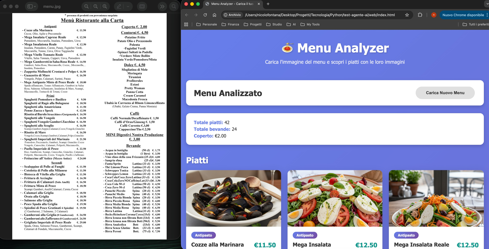
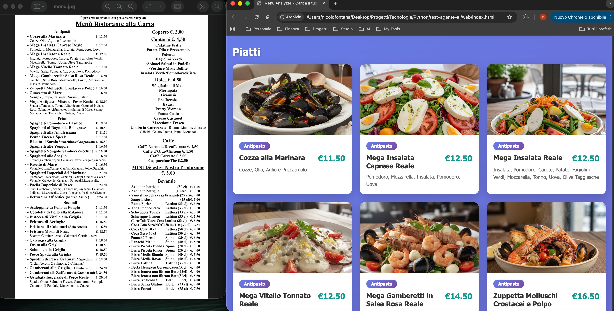

# Menu Analyzer API

API FastAPI che analizza immagini di menu di ristoranti utilizzando AI per estrarre piatti, bevande e prezzi. Genera automaticamente immagini dei piatti utilizzando modelli di intelligenza artificiale.




## Installazione e Avvio

```bash
# Clona il repository
git clone https://github.com/nicolo-fontana/menu-analizer.git
cd menu-analizer

# Installa le dipendenze
uv sync

# Crea un file .env con la tua chiave API
echo "OPENAI_API_KEY=your-api-key-here" > .env

# Avvia il server
uv run uvicorn main:app --reload
```

Il server sarà disponibile su `http://localhost:8000`

## Note

Questo progetto è solo un esperimento, non è pronto per la produzione!
